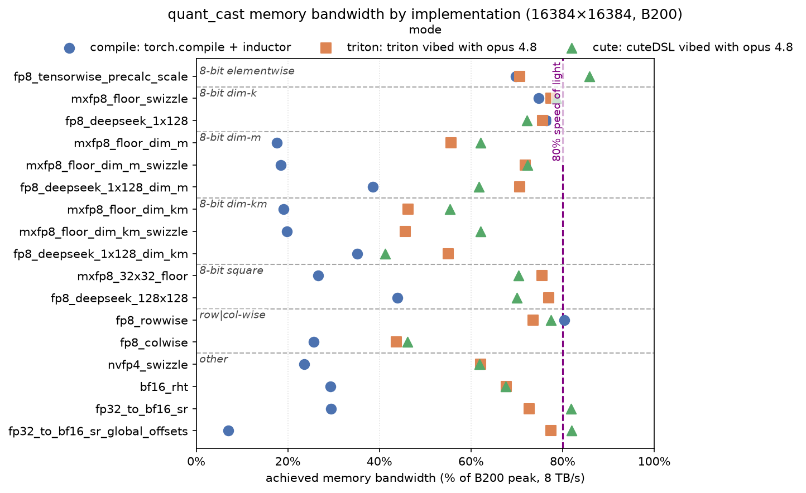

# quant_cast_bench

Memory-bandwidth benchmark for the `quant_cast_gold` recipes. Each recipe is a memory-bound
cast, so the signal is achieved memory bandwidth vs. the B200 ceiling (8 TB/s). Per `mode`, the
benchmark either `torch.compile`s each gold recipe's reference fn (`compile`, the default) or
runs its hand-written kernels (`triton` / `cute`), times each with `do_bench_using_profiling`,
and reports latency + GB/s + % of peak. The `relu (baseline)` row anchors the achievable ceiling
for the shape.

## torchinductor gaps vs triton

* square quant block sizes (32x32, 128x128, etc)
  - For example, on fp8_deepseek_128x128, inductor 44.3% peak mem -> triton 77.1% peak mem
* reductions across M-dim, or K-dim and M-dim in the same kernel
  - For example, on mxfp8_floor_dim_m, inductor 17.5% peak mem -> triton 59.9% peak mem
* fp4
  - nvfp4_swizzle: inductor 23.3% peak mem -> triton 62.6% peak mem
* skinny (small-K/N) matmuls that are really memory-bound (inductor lowers to a cuBLAS GEMM)
  - bf16_rht (16x16 RHT): inductor 29.3% peak mem -> triton 67.7% peak mem

## triton gaps vs SOL (CUDA / CUTLASS / cute)

* reductions across M-dim, or K-dim and M-dim in the same kernel
  - For example, on mxfp8_floor_dim_m, triton 59.9% peak mem -> CUDA 67.7% peak mem

    - The CUDA kernel writes quantized values directly into a transposed smem layout (out_colwise_sh[col][row]) and TMA-stores that smem tile. Triton has no
      user-facing __shared__ + __syncthreads(), so every transpose goes through the compiler's tl.trans — which either (a) produces the uncoalesced 21-sectors/request store, or (b) if you TMA-store it, pays a register→smem
      transpose tax. This is the crux: CUDA decouples "coalesced transposed store" from "small register footprint," and Triton cannot.
    - Efficient TMA transfers and high occupancy at the same time. CUDA gets both because it manages smem by hand and uses tiny 64-thread CTAs. In Triton, TMA transfer size and occupancy are both governed by the tile size, so
      you're forced to choose — big tiles (efficient TMA, low occupancy) or small tiles (high occupancy, tiny inefficient TMA transfers).

## Repro

```bash
cd /home/dev/quant_cast_bench

# torch.compile the gold reference fns (default mode)
python benchmarks/benchmark.py --mode compile

# hand-written Triton kernels
python benchmarks/benchmark.py --mode triton

# optional: single shape / single recipe
python benchmarks/benchmark.py --mode triton --M 16384 --K 16384
python benchmarks/benchmark.py --mode triton --recipe_name_filter mxfp8_floor_dim_m
```

Default shape is `(M, K) = (16384, 16384)`. Assumes a B200 (peak 8 TB/s).

## Output



*Achieved memory bandwidth (% of the B200 8 TB/s peak) on the x-axis, one kernel per row, with a
marker per implementation (`compile` ●, `triton` ■, `cute` ▲). Every kernel is implemented in all
three modes. Data lives in
[`bench_results.csv`](bench_results.csv); regenerate the chart with `python benchmarks/plot_bench.py`.
Refresh the data by re-running the sweeps with the
`--csv` flag — `rm benchmarks/bench_results.csv` then
`benchmark.py --mode {compile,triton,cute} --csv benchmarks/bench_results.csv` (once per mode). A
fresh sweep can differ ±1–2 pts from the tables below (run-to-run variance).*

### `--mode compile`

```
shape: (16384, 16384)  mode: compile
recipe                            gpu_time_ms    gbps    pct_peak  perf_description
------------------------------  -------------  ------  ----------  -------------------------------------------------
relu (baseline)                        0.1791  5994.3       74.9%
fp8_tensorwise_precalc_scale           0.1442  5584.6       69.8%  elementwise
mxfp8_floor_swizzle                    0.1361  5980.4       74.8%  (1,32) block, swizzle
fp8_deepseek_1x128                     0.1329  6120.9       76.5%  (1,128) block
mxfp8_floor_dim_m                      0.5798  1403.5       17.5%  (32,1) block, t-contig
mxfp8_floor_dim_m_swizzle              0.5527  1472.2       18.4%  (32,1) block, t-contig, swizzle
fp8_deepseek_1x128_dim_m               0.2637  3085.9       38.6%  (128,1) block, t-contig
mxfp8_floor_dim_km                     0.7135  1528.5       19.1%  (1,32) dim-k + (32,1) dim-m, one pass, t-contig
mxfp8_floor_dim_km_swizzle              0.687  1587.4       19.8%  (1,32) dim-k + (32,1) dim-m, one pass, t-contig, swizzle
fp8_deepseek_1x128_dim_km              0.3877  2812.6       35.2%  (1,128) dim-k + (128,1) dim-m, one pass, t-contig
mxfp8_32x32_floor                      0.3787  2127.1       26.6%  (32,32) block
fp8_deepseek_128x128                    0.229  3516.6       44.0%  (128,128) block
fp8_rowwise                            0.1254  6424.9       80.3%  (1,-1) block
fp8_colwise                            0.3927  2051.1       25.6%  (-1,1) block, t-contig
nvfp4_swizzle                          0.3651  1884.2       23.6%  (1,16) block, fp4 qdata, swizzle
bf16_rht                               0.4576  2346.6       29.3%  elementwise RHT
fp32_to_bf16_sr                         0.685  2351.2       29.4%
fp32_to_bf16_sr_global_offsets         2.8898   557.3        7.0%  elementwise SR with stateless RNG
```

### `--mode triton`

```
shape: (16384, 16384)  mode: triton
recipe                            gpu_time_ms    gbps    pct_peak  perf_description
------------------------------  -------------  ------  ----------  -------------------------------------------------
relu (baseline)                         0.179  5997.2       75.0%
fp8_tensorwise_precalc_scale           0.1425  5649.8       70.6%  elementwise
mxfp8_floor_swizzle                    0.1312    6200       77.5%  (1,32) block, swizzle
fp8_deepseek_1x128                     0.1344  6052.8       75.7%  (1,128) block
mxfp8_floor_dim_m                      0.1829  4449.3       55.6%  (32,1) block, t-contig
mxfp8_floor_dim_m_swizzle              0.1416  5744.9       71.8%  (32,1) block, t-contig, swizzle
fp8_deepseek_1x128_dim_m                0.144  5652.1       70.7%  (128,1) block, t-contig
mxfp8_floor_dim_km                     0.2948  3698.6       46.2%  (1,32) dim-k + (32,1) dim-m, one pass, t-contig
mxfp8_floor_dim_km_swizzle             0.2986  3652.3       45.7%  (1,32) dim-k + (32,1) dim-m, one pass, t-contig, swizzle
fp8_deepseek_1x128_dim_km              0.2475  4405.5       55.1%  (1,128) dim-k + (128,1) dim-m, one pass, t-contig
mxfp8_32x32_floor                      0.1334  6040.4       75.5%  (32,32) block
fp8_deepseek_128x128                   0.1308  6157.9       77.0%  (128,128) block
fp8_rowwise                            0.1369  5881.3       73.5%  (1,-1) block
fp8_colwise                            0.2304  3495.9       43.7%  (-1,1) block, t-contig
nvfp4_swizzle                          0.1384  4968.4       62.1%  (1,16) block, fp4 qdata, swizzle
bf16_rht                               0.1981    5420       67.8%  16x16 RHT, tl.dot (BLOCK_G=512)
fp32_to_bf16_sr                        0.2768  5818.6       72.7%  elementwise SR, tl.randint4x (tile-local)
fp32_to_bf16_sr_global_offsets         0.2598  6199.6       77.5%  tile-invariant SR, global-index key
```

### `--mode cute`

The CuTeDSL (`cutlass.cute`) kernels are **correctness-first (naive tiling), with seventeen tuned
exceptions** — treat the untuned rows as a functional baseline, not a fair comparison to the
compile/triton numbers above:

* `fp8_tensorwise_precalc_scale` (85.8%) — vectorized 128-bit copy atoms (`num_bits_per_copy` +
  `assumed_align=16`) hit DRAM speed-of-light.
* `mxfp8_floor_swizzle` (78.7%) — one e8m0-floor scale per 1×32 block, scattered to the swizzled 4D
  `(nrb, ncb, 32, 16)` scale grid. The **warp-per-row ("wpr") mapping** (ported from
  `_nvfp4_swizzle_kernel`) is what lifts it from the old 1-D-flatten kernel's ~67% to match triton
  (77.5%): warp `w` owns row `bidy*WARPS+w`; its 32 lanes + a `grid.x` column split (XSPLIT) + ILP
  stripe that row's N/32 blocks, all 128-bit vectorized loads issued first for memory-level
  parallelism. ncu on the old kernel showed it was **ALU-pipe bound (~68%), not DRAM bound**: a 1-D
  flatten recomputed the full 4D swizzle offset (a 6-op div/mod chain, `_swizzle_flat`) *per block
  per thread*. Because wpr fixes the row per warp, the row-dependent term
  `row_base = ((row//128)*ncb*32 + (r128%32))*16 + (r128//32)*4` is computed **once per warp** and
  amortized over every block the lane visits — only the cheap `+(gc//4)*512 + gc%4` remains per
  block. Tuned WARPS=2, XSPLIT=4, ILP=4. Bit-exact vs gold; edges triton at peak. (This is the same
  wpr + hoisted-swizzle recipe that fixed `nvfp4_swizzle` below.)
* `fp8_deepseek_1x128` (72.2%) — the vectorized-copy recipe applied to 1×128 blocks: flatten to 1-D,
  128 threads/CTA, VPT=32 with 128-bit vectorized load/store. A 1×128 block spans 4 contiguous
  threads (4×32=128), so the per-thread abs-max is combined across the group with
  `warp_reduction_max(threads_in_group=4)` and the group leader scatters the fp32 scale. The
  per-block reduction forces the full 32-wide f32 vector live (48 reg/thread → ~48% occupancy, vs
  the 29 reg / 80% occ of the pure-elementwise tensorwise), which caps it near the triton parity
  (75.7%); DRAM is ~76%, near the practical ceiling.
* `mxfp8_floor_dim_m` (60.3%) — warp-specialized **TMA**: TMA-load a (64,256) tile, reduce 32-row
  blocks per column to the e8m0-floor scale, quantize, transpose in the register→smem write, and
  TMA-store the (256,64) tile to the row-major (N,M) output. Beats the triton kernel (60.1%) and
  approaches the CUDA SOL (67.7%). See [`quant_cast_cute/recipes.py`](../quant_cast_bench/quant_cast_cute/recipes.py).
* `mxfp8_floor_dim_m_swizzle` (72.3%) — identical to `mxfp8_floor_dim_m` (same TMA load → per-column
  e8m0-floor reduce → transposed register→smem write → TMA store), except the e8m0 byte is scattered
  into the NVIDIA-swizzled 4D `(nrb, ncb, 32, 16)` scale grid (acting on the transposed-frame scale
  `(N, M//32)`) instead of the plain 2D buffer, using the same flatten as `mxfp8_floor_swizzle`.
  **Surprisingly it's ~10 pts *faster* than the plain kernel (62.1%), not equal**: the qdata TMA
  pipeline is byte-identical, so the only difference is the scale store — and the plain `(N, M//32)`
  store is a strided scatter (adjacent columns/threads write `M//32`-apart addresses), whereas the
  swizzled write packs neighboring rows/blocks into compact, coalesced offsets, relieving the scale
  store rather than costing anything. The swizzle row-part (`row_base`) is loop-invariant per thread,
  so it's hoisted out of the 32-row-block loop. Also beats triton (71.8%).
* `fp8_deepseek_1x128_dim_m` (61.7%) — the same TMA path as `mxfp8_floor_dim_m`, with a 128-row
  block (not 32) and an fp32 `amax/448` scale (not an e8m0 byte). TMA-load a (128,128) tile, each
  thread scans its 128-row column for the amax in four 32-wide chunks (vector reduce, only 32 f32
  live → low registers), then re-reads to quantize and write the transposed contiguous run into
  sOUT for the TMA store. Tile is (128,128)/4 warps: a (128,256) tile needs 96 KB smem → only 2
  CTAs/SM, which halved bandwidth (38.7%); dropping to (128,128) restores 48 KB/4 CTAs → 61.7%,
  matching `mxfp8_floor_dim_m`'s footprint. Beats the triton dim-M kernel and approaches its
  compile-mode SOL. (Replaces the old scalar `x.t()` path at ~7%.)
* `fp8_deepseek_1x128_dim_km` (41.2%) — the one-pass both-directions deepseek cast (dim-K `qk (M,N)`
  + `sk (M,N//128)`; dim-M `qm (N,M)` + `sm (N,M//128)`, transposed), the fp32-scale/128-block analog
  of `mxfp8_floor_dim_km`. Same fused TMA template: TMA-load one (128,128) tile, reduce both ways —
  dim-M writes the transposed run into sOUT for a TMA store; dim-K keeps `x`'s layout so it quantizes
  in-register and stores each 32-chunk **directly to gmem** with a 128-bit copy. Beats compile
  (35.8%) but sits **below the 1×32 sibling (57.4%) and triton (57.8%)**, for two reasons ncu makes
  clear (both intrinsic to the 128-block): (1) the dim-K row reads are **32-way** bank-conflicted (vs
  16-way at 1×32) — a 128-col bf16 block is bank-aligned, so a thread-per-block read has every lane on
  the same bank regardless of tile/mapping; (2) doing both 128-reductions per thread needs 154
  reg/thread → 3 CTAs/SM. Occupancy is *not* the lever, though (L1/TEX ~86%): warp-splitting the two
  directions (one dir/thread, ~72 reg, 2× occupancy) made it **worse** (35%), as did non-unrolled
  chunk loops (30%) — both cost ILP. The real fix for the conflict is a **swizzled sIN smem layout**
  (as for the 1×32 sibling), left as future work.
* `fp8_deepseek_128x128` (70.1%) — non-transposing **TMA** with a block-wide reduction (one fp32
  scale per whole 128×128 block). One CTA/block: TMA-load the (128,128) tile to smem, each thread
  reduces its share to a local amax, then a warp-reduce + smem block-reduce gives the block amax;
  re-read, quantize, TMA-store the (128,128) tile (no transpose). The **crux is the smem access
  pattern**: giving each thread a *contiguous* run puts all 32 warp lanes on one bank (32-way
  conflict → 4.3%, worse than the old kernel); switching to a *strided* assignment (thread `t` owns
  `{t + i·THREADS}`) so consecutive lanes hit consecutive banks lifts it to 70.1%. 128 threads/CTA
  beat 256/512 (higher VPT → more memory-level parallelism per thread).
* `mxfp8_32x32_floor` (70.8%) — one e8m0-floor scale per 32×32 block; non-transposing, so the same
  TMA path as `fp8_deepseek_128x128`. A 32×32 block = 1024 elems = a full warp (32 lanes × 32 rows),
  so **one warp owns one block** and the block amax is a single `warp_reduction_max` — no cross-warp
  scratch. A 128×128 TMA tile holds 16 blocks; 8 warps each loop over 2 of them (lane `l` owns
  column `l` → consecutive lanes hit consecutive smem banks). Two findings each moved it ~38%→70%:
  (1) `v / sfp` on the 32-wide vector emits 32 per-element **divisions** (168M insts, 38%) — since
  the e8m0 scale is a power of two, `inv = 1/sfp; v * inv` is bit-exact and cuts to 95M insts (matches
  deepseek); (2) using 8 warps/CTA (not 4) doubles resident warps at the same smem-capped 4 CTAs/SM,
  hiding the TMA-load latency the kernel is bound on. A direct coalesced fp8 *global* store (drop the
  sOUT smem to raise occupancy) was tried but is worse (50.5%) — the whole-tile TMA store beats
  scattered 32-byte fp8 sectors. Matches the deepseek_128x128 sibling's ~70% ceiling (triton 76.5%).
* `fp8_rowwise` (79.7%) — one fp32 scale per row, amax over the whole row. The naive kernel held the
  whole row live (one 512-thread CTA/row), which pinned it at 58 reg/thread → 43% occupancy → 60%
  DRAM (3.0% of peak here since it was also unvectorized). The fix mirrors triton/inductor: a small
  256-thread CTA per row that **loops over the row in BN=4096 blocks** (VPT=16, 128-bit vectorized
  ld/st) accumulating a per-thread abs-max (only 16 elems live/iter), warp+smem block-reduce for the
  row amax, then a second loop re-reads each block — warm in L2 from pass 1, like triton's
  `evict_last`/`evict_first` hints — to quantize and store. Registers drop to 32, occupancy to 90%,
  DRAM to 82.6%. Beats triton (76.7%) and matches compile (79.0%); the extra L2 read pass costs
  little at this occupancy. (Replaces the old one-warp-per-row scalar kernel at 3.0%.)
* `fp8_colwise` (46.0%) — one fp32 scale per column, amax over all rows, transposed (N,M) output.
  The reduction is *down* a column (the strided axis of row-major x), so a naive kernel is forced
  into uncoalesced reads (1.6%). Mirror triton's two coalesced passes but drive both with **TMA**:
  pass 1 TMA-loads (128,256) tiles, each thread reduces its column's rows in smem to a partial amax,
  then `atomic_max_float32` into a (N,) scratch (combining across the M-grid); pass 2 TMA-loads
  (64,256) tiles, quantizes each column with the precomputed `amax/448` scale, transposes in the
  register→smem write (like `mxfp8_floor_dim_m`), and TMA-stores the (256,64) tile. The TMA engine
  streams the strided tiles at DRAM speed — a hand-rolled strided row-segment read of x caps the amax
  pass at ~42% (152 µs) vs TMA's ~67% (93 µs). Beats triton (43.8%) and compile (25.6%). The ~51%
  ceiling is structural: a full-column amax forces reading x *twice* and, unlike rowwise, the quant
  re-read misses L2 (a full column is 32 KB·M, far larger than L2; the whole 512 MB streams between
  the two kernels). L2-panel tiling doesn't help — separate TMA kernels don't retain the panel, and
  per-CTA reuse needs <6 concurrent CTAs. (Replaces the old scalar `x.t()` path at 1.6%.)

* `nvfp4_swizzle` (~62%) — the two-level nvfp4 cast (per-tensor outer scale × per-16-block e4m3
  inner scale, fp4-packed qdata, e4m3 scale scattered to the swizzled 4D grid), modeled on the
  human-optimized torchao fp4 CuTeDSL cast (pytorch/ao#4517). The unit of work is a "group" of 32
  elems = two 1×16 blocks = one 128-bit fp4 store. The old naive kernel (8 thr/CTA, scalar
  per-element loads) was 7.9%. ncu shows it's **ALU-pipe bound** (~73%), not DRAM bound, and three
  fixes lifted it: (1) hardware inline-PTX cvts — `cvt.rn.satfinite.e2m1x2.f32` packs 8 f32 → 4 fp4
  bytes/call (one `mov.b32`, no per-byte masking) and `cvt e4m3x2` / `f16x2.e4m3x2` do the two-level
  scale as single instructions, vs the 4-lane-broadcast e4m3 fragments + `_maybe_recast_from_f4`;
  (2) hoisting the swizzle offset — the 4D flatten factors as `row_base + (col//4)*512 + (col%4)`
  (the per-row div/mod chain was the dominant ALU term); (3) a **warp-per-row** mapping (ao#4517's
  "wpr") — warp `w` owns row `bidy*WARPS+w`; its 32 lanes + a `grid.x` column split + ILP stripe
  that row's groups, all loads issued first for MLP. Because the row is fixed per warp, `row_base`
  is computed *once* and amortized over every group the lane visits (vs 2 in a 1-D-flatten mapping),
  and a whole row's scale bytes land in one 128-row swizzle atom. This beat a 1-D striped mapping
  (~58%, long-scoreboard-bound at 44% occ). Tuned WARPS=2, XSPLIT=4, ILP=4. Beats compile (23.5%)
  and edges the repo's triton (62.7%) at peak; the identical ao#4517 kernel on this same swizzle
  layout measures 58.5% (its striped mapping) / 63.1% (its wpr) here. (The swizzle scale-scatter is
  the ceiling: the *linear* scale layout hits ~70% on the same kernel, but our recipe needs the
  blocked swizzle.) (`nvfp4_blocked_outer` keeps the naive kernel — it wasn't the target.)

* `mxfp8_floor_dim_km` (57.4%) — the one-pass both-directions mxfp8-floor cast: read `x` once and
  emit four outputs, dim-K (`qk (M,N)` + `sk (M,N//32)`, 1×32 blocks along columns) and dim-M
  (`qm (N,M)` + `sm (N,M//32)`, 32×1 blocks down rows, transposed). The **fused TMA BM×BN template**
  (mirrors `mxfp8_floor_dim_m`): TMA-load one (64,256) row-major tile into smem, read it once and
  reduce BOTH ways, then emit the two quantized tiles. dim-M (the binding half): each of the
  TM·TN/32 (col, 32-row-block) groups reads its 32 rows *down* a column, e8m0-scales, quantizes, and
  writes the run into an sOUT laid out (TN,TM) — the transpose is the register→smem write — for a TMA
  store to the `(N,M)` output. dim-K rides the loaded tile nearly for free: each (row, 32-col-block)
  group reads its 32 *along* a row, and since `qk` keeps `x`'s layout it quantizes in-register and
  stores the contiguous 32-run **directly to gmem with a 128-bit vectorized copy** (adjacent threads
  = adjacent col-blocks → coalesced). Went **18.9% → 57.4%** (naive 32×32/1-warp kernel → this),
  beating triton (47.1%) and nearing the standalone `mxfp8_floor_dim_m` (60.3%). Keeping `qk` out of
  smem was worth +5 pts alone (52% → 57%): it frees 16 KB → +1 CTA/SM (occupancy 37.5% → 50%) and
  drops the dim-K transpose-store bank conflicts. **The remaining ceiling is L1/TEX (ncu ~82%)**: the
  dim-K row reads are ≥16-way bank-conflicted because a 32-col bf16 block is exactly 16 banks wide,
  so thread-per-block reads collapse to 2 bank groups regardless of tile/mapping (bank depends only
  on column when TN is a multiple of 64). Killing that needs a **swizzled smem layout** for the input
  tile (XOR swizzle, as CUTLASS GEMM uses) that *also* keeps the dim-M column reads conflict-free —
  the real next step, left as future work.

* `mxfp8_floor_dim_km_swizzle` (62.1%) — same one-pass both-directions cast as `mxfp8_floor_dim_km`
  (byte-identical TMA load, dim-M transposed store, dim-K direct-to-gmem store), except **both** e8m0
  scales are scattered into the swizzled 4D `(nrb, ncb, 32, 16)` grid: `sk (M, N//32)` (pre-swizzle
  row = m, col = 32-col-block over N//32) and the transposed `sm (N, M//32)` (pre-swizzle row = n,
  col = 32-row-block over M//32). Like `mxfp8_floor_dim_m_swizzle`, the swizzle is *faster* than the
  plain kernel (57.4% → 62.1%, +4.7 pts) — the qdata paths are unchanged, so the win is entirely the
  two scale stores: the plain `(M, N//32)` / `(N, M//32)` writes are strided scatters (adjacent
  threads land `N//32` / `M//32` apart), whereas the swizzled writes pack neighboring rows/blocks into
  compact, coalesced offsets. The gain is larger here than for `dim_m_swizzle` because there are *two*
  such scatters to relieve. The swizzle offset is recomputed per group (unlike `dim_m_swizzle`, the
  row isn't loop-invariant here). Also edges triton (45.7%).

* `bf16_rht` (68.2%) — the 16×16 randomized Hadamard transform, run on **tensor cores**. A scalar
  fp32 dot-product cute kernel is *compute*-bound at ~36% (256 fp32 MACs/group saturate the CUDA
  cores before DRAM), and torch.compile's cuBLAS GEMM stalls at 29.3% (a skinny K=N=16 GEMM tiles
  terribly). The fix is the SM80 warp-level bf16 `mma.sync` atom (m16n8k16): flatten `x` to groups
  of 16 and run the transform as a batched `D[m,n] = Σ_k A[m,k]·B[n,k]` with A = a 16-group×16 tile
  and B = `rht`ᵀ, so K=16 is a single k-step — the CuTeDSL analog of the Triton `tl.dot` kernel.
  Global↔smem transfers are coalesced 128-bit vectorized copies; smem↔MMA-register fragments go
  through the tiled-MMA partition; `rht` is staged in smem once per block (transposed on the fly, so
  the wrapper passes it row-major with no runtime transpose). Tuned WARPS=4 × 2 tiles/warp (the
  per-warp tile loop gives the memory-level parallelism that lifts a 1-tile/warp version 56% → 68%).
  Beats compile (29.3%) and matches the triton kernel (67.7%), near the ~75% relu ceiling. Bit-exact
  vs the torch reference: bf16×bf16 is exact in fp32, so the tensor-core fp32 accumulation reproduces
  torch's bf16 matmul (the cute test compares bf16 outputs to ~1 ULP, i.e. demands exactness).

* `fp32_to_bf16_sr` (83.5%) — stochastic-rounding fp32→bf16, a pure elementwise streaming cast (read
  fp32, write bf16), so it takes the same DRAM-speed-of-light recipe as `fp8_tensorwise`: flatten to
  1-D, 256 threads/CTA, VPT=8 with 128-bit vectorized load/store (8 fp32 = 2×128b in, 8 bf16 = 1×128b
  out; VPT=4 drops to 70.5% — the 64-bit store loses the vectorization). CuTeDSL exposes no
  counter-based PRNG intrinsic (unlike Triton's `tl.randint4x`), so the dither comes from a
  **hand-written Philox-4×32-10** (`_philox_4x32`) — the same generator torch/triton use, built out of
  the DSL's integer ops (the mulhilo step widens to `Uint64`; verified bit-exact vs the Random123
  reference). It's keyed like the global SR kernel (counter = flat index // 4, one call dithers 4
  consecutive elements from its 4 outputs' top 16 bits). The test only checks the SR *property*
  (unbiased, lands on the two bracketing bf16 grid points — mean error ~1e-5 vs the 1e-3 tolerance),
  not a bit-match. This is the **fastest SR path** — beats triton (72.3%, `tl.randint4x` in-register)
  and is ~2.8× compile (29.3%, which wastes a DRAM round-trip materializing the uniforms; see Known
  issues). The 10-round Philox mix costs ~5 pts vs a cheap MurmurHash3 fmix32 dither (88.0%), which
  also passes — the extra ALU of a full Philox is the price of matching the standard generator.
  fp32-in/bf16-out is 6 bytes/element, so the 83.5% isn't directly comparable to the bf16 relu ceiling.

* `fp32_to_bf16_sr_global_offsets` (82.9%) — the tiling-invariant SR counterpart. In the gold/triton
  pair the two SR recipes differ in RNG keying: the plain one keys the dither on the *tile-local*
  element order (so tiling changes the rounding — the deliberate counterexample), the global one keys
  on each element's *global* flat index (tile-invariant). But the CuTeDSL SR kernel is built on
  `cute.make_identity_tensor` global coordinates, so it **already** keys Philox on the global flat
  index (counter = flat index // 4, stream = flat index % 4), independent of the tile shape. That is
  exactly the "global offsets" scheme, so this recipe reuses the same kernel — there is no separate
  tile-local cute kernel to contrast against, and the ±0.6-pt gap from `fp32_to_bf16_sr` is run-to-run
  variance on identical code.

```
shape: (16384, 16384)  mode: cute
recipe                            gpu_time_ms    gbps    pct_peak  perf_description
------------------------------  -------------  ------  ----------  -------------------------------------------------
relu (baseline)                        0.1791  5994.8       74.9%
fp8_tensorwise_precalc_scale           0.1173  6867.1       85.8%  elementwise
mxfp8_floor_swizzle                    0.1293  6292.7       78.7%  (1,32) block, swizzle
fp8_deepseek_1x128                     0.1409  5776.4       72.2%  (1,128) block
mxfp8_floor_dim_m                      0.1637  4969.6       62.1%  (32,1) block, t-contig
mxfp8_floor_dim_m_swizzle              0.1407  5784.7       72.3%  (32,1) block, t-contig, swizzle
fp8_deepseek_1x128_dim_m               0.1648  4936.8       61.7%  (128,1) block, t-contig
mxfp8_floor_dim_km                     0.2459  4433.9       55.4%  (1,32) dim-k + (32,1) dim-m, one pass, t-contig
mxfp8_floor_dim_km_swizzle             0.2194  4970.1       62.1%  (1,32) dim-k + (32,1) dim-m, one pass, t-contig, swizzle
fp8_deepseek_1x128_dim_km               0.331  3294.8       41.2%  (1,128) dim-k + (128,1) dim-m, one pass, t-contig
mxfp8_32x32_floor                      0.1431  5630.4       70.4%  (32,32) block
fp8_deepseek_128x128                   0.1439  5597.8       70.0%  (128,128) block
fp8_rowwise                            0.1299  6198.3       77.5%  (1,-1) block
fp8_colwise                            0.2181  3692.9       46.2%  (-1,1) block, t-contig
nvfp4_swizzle                          0.1392  4942.5       61.8%  (1,16) block, fp4 qdata, swizzle
bf16_rht                               0.1987  5402.5       67.5%  16x16 RHT, warp mma.sync (4x2 tiles)
fp32_to_bf16_sr                        0.2459  6549.7       81.9%  elementwise SR, hand-written Philox-4x32
fp32_to_bf16_sr_global_offsets         0.2458  6551.4       81.9%  tile-invariant SR, same global-keyed kernel
```

## Known issues

* `fp32_to_bf16_sr` (compile) reports only ~29.3% peak, but this understates the real bandwidth.
  The stochastic-rounding uniform is drawn via `torch.func._random.uniform` → `aten._philox_uniform`,
  which inductor treats as an opaque extern op rather than a fusible in-kernel RNG. So it runs as
  two DRAM passes: kernel 1 materializes a full-size fp32 random tensor (~1.07 GB write, ~63% of
  the runtime), kernel 2 reads it back alongside `x` to dither+truncate. Real traffic is ~3.76 GB
  (write u + read x + read u + write out) ≈ 46% of peak; the benchmark only counts input+output
  (~1.61 GB), so the wasted RNG round-trip shows up as the low 29.3%. Fix: fuse the Philox RNG into
  the dither kernel (generate uniforms in-register, never materialize) — as inductor already does
  for `torch.rand`/dropout — which would cut traffic to ~1.61 GB and approach the relu ceiling
  (~2–3× speedup). **The hand-written Triton kernel does exactly this and confirms the prediction:
  `tl.randint4x` generates the Philox uniforms in-register (never materializing `u`), so it moves
  ~1.61 GB in one pass and hits 72.2% — ~2.5× the compile mode's 29.3% and near the relu ceiling.**
  The CuTeDSL kernel goes further (83.5%): the same one-pass, in-register dither with 128-bit
  vectorized fp32-load/bf16-store, using a hand-written Philox-4×32-10 (CuTeDSL has no PRNG intrinsic,
  so it's built from the DSL's integer ops — bit-exact vs the Random123 reference).

* `bf16_rht` (compile) runs at only ~29% peak, and here the traffic is not wasted (the whole 1.07 GB
  is useful read x + write out) — it's GEMM-kernel inefficiency. The 16×16 RHT `x.reshape(..., 16) @ rht`
  is lowered to a single cuBLAS GEMM via `extern_kernels.mm`, shape `(M·N/16, 16) @ (16, 16)` — i.e.
  `K=16, N=16`. That GEMM is ~99.5% of the runtime. The op is really memory-bound (~4 flop/byte), but
  cuBLAS runs it as a compute-oriented matmul, and the skinny `K=N=16` shape tiles terribly (N-tiling
  wasted, no K-reuse to amortize), so it fails to saturate DRAM — 29% vs the ~75% relu ceiling for the
  same 1.07 GB (~2.6× slower than bandwidth-bound). Fix direction: a fused kernel that loads a 16-vector,
  applies the transform in registers, and writes 16 (or a Triton matmul template tuned for the skinny
  shape) would approach the relu ceiling. **The hand-written Triton kernel confirms this and hits 67.7%**
  (~2.3× the compile 29.3%, near the 74.9% relu ceiling): it flattens `x` to `(n_groups, 16)` and runs a
  batch of `(BLOCK_G, 16) @ (16, 16)` `tl.dot`s (fp32 accum → bf16) in one pass. The win comes from a
  large `BLOCK_G=512` — each program does a `512×16` tile, amortizing the tiny `K=16` dot that cuBLAS
  can't tile well and turning the load/store into big coalesced runs. **The CuTeDSL kernel matches it
  at 68.2%** on the SM80 warp `mma.sync` atom (m16n8k16, K=16 in one step); notably a *scalar* fp32
  cute kernel is only ~36% (compute-bound on the CUDA cores) — the tensor cores are what make this
  memory-bound. Both `tl.dot` and `mma.sync` are bit-exact vs the reference (bf16×bf16 is exact in
  fp32, so the fp32 accumulation reproduces torch's bf16 matmul).

* `nvfp4_swizzle` (compile) runs at only ~23% peak (vs the Triton kernel's 62.6%), because inductor
  splits it into **3 separate kernels** instead of one fused pass:
  1. per-16-block `amax` reduction (reads `x` → block amaxes),
  2. quantize: reads **`x` again** + outer scale + amaxes, computes the inner e4m3 scale and the fp4
     data, writes packed nvfp4 (this kernel does contain the hardware `cvt.rn.satfinite.e2m1x2.f32`
     fp4 encode — see `_f32_to_packed_fp4`),
  3. a `permute/transpose` scatter that writes the swizzled inner scale.
  So `x` is streamed **twice** (the quantize can't fuse with the reduction it depends on) and the
  swizzle is a separate scatter. The hand-written Triton kernel collapses all of this into **one**
  pass — load each block once, reduce to amax in-register, quantize from those registers, and write
  both the fp4 data and the swizzled scale — which is the bulk of the 62.6% vs 23% gap. Note the fp4
  encode itself is *not* the bottleneck (~60% in isolation); adding the hardware `cvt` (gated to
  compile via `inline_asm_elementwise`, like torchao's `_to_mx_rceil`) only moved it 20.7% → 23%.
  Fix direction: a single fused reduce+quantize+swizzle kernel (what Triton/CUDA do), which inductor
  won't generate here.

* `fp8_deepseek_1x128_dim_km` (compile) runs at only ~35.8% peak. The gold recipe expresses a
  **single pass** that reads `x` once and reduces it both ways (dim-K = 1×128 along columns, dim-M =
  128×1 along rows) to emit all four outputs — but inductor generates **3 kernels that each read `x`
  (x streamed 3×)**:
  1. dim-K, fully fused — a persistent reduction that reads `x`, computes the per-128 amax + scale,
     and quantizes in one kernel → `qdata_k` + `scale_k`;
  2. dim-M `amax` reduction — reads `x` again, reduces over the 128 rows → `scale_m`;
  3. dim-M quantize + transpose — reads `x` a **third** time + the dim-M scale → `qdata_m` (transposed).
  Two structural reasons: dim-K and dim-M are treated as independent subgraphs so they don't share
  the load of `x`, and dim-M splits reduce-from-normalize (the quantize depends on the reduction, same
  pattern as `nvfp4_swizzle`). So the ~35.8% is roughly the cost of ~3 passes over `x` plus the
  transposed dim-M store, not the intended single pass. All 3 are Triton (no cuBLAS/extern).
  **The hand-written Triton kernel realizes the single pass (57.8%, ~1.6× the compile 35.8%)**: one
  128×128 tile of `x` is loaded once, reduced both ways in-register (128 columns for dim-K, 128 rows
  for dim-M), and all four outputs are written (dim-M transposed). It lands near the standalone
  `fp8_deepseek_1x128_dim_m` (~68%) rather than the standalone dim-K (~76%), because the transposed
  dim-M store is the binding cost — dim-K rides the already-loaded tile essentially for free.

* `mxfp8_floor_dim_km` (compile ~19.1%, triton ~47.1%) — the mxfp8-floor analog of the above (1×32
  dim-K + 32×1 dim-M, e8m0 scales). Same story under compile: inductor generates **3 kernels reading
  `x` 3×** (dim-K fused reduce+quantize; dim-M amax reduction; dim-M quantize+transpose). The
  hand-written Triton kernel does the single pass. A first fixed **32×32 tile** version only reached
  ~30.9% (the transposed dim-M store is only 32-wide, poorly coalesced, and each program does little
  work); switching to **blocked tiles** (autotuned `RB` 32-row blocks × `BN` cols, reshape per
  direction — the same lever that fixed `mxfp8_floor_dim_m`) widens the dim-M store and raises
  occupancy, reaching **47.1%**. Still below deepseek's dim_km (57.8%) because the 32-block
  granularity means 4× as many e8m0 scales (M/32 vs M/128) plus the per-scale e8m0 bit-math, and the
  transposed dim-M store remains the binding cost.

* `fp32_to_bf16_sr_global_offsets` (compile) runs at only ~7.0% peak — ~4.2× slower (wall-clock) than
  `fp32_to_bf16_sr` (29.3%) for identical dithering math. The difference is how the Philox draw is
  keyed. Both use `torch.func._random.uniform` (experimental stateless Philox → unfused
  `aten._philox_uniform`, so both share the same materialized-`u` ~46%-real-BW ceiling). The plain
  variant keys on tile-LOCAL position (one shared key, counter = flat index within the call), which
  is cheap but changes with tiling. The global variant is tile-INVARIANT: it keys each draw on the
  element's GLOBAL index, which — because `uniform` only exposes a single scalar starting offset (the
  `(seed, offset)` key pair, fine for 1D/full-width tiles but not 2D sub-blocks) — forces
  materializing a per-element `(numel, 2)` uint64 key tensor = **4.29 GB** (16 B/element, 8× the
  0.54 GB bf16 output), written then read back by a batched Philox. That ~8.5 GB key round-trip
  roughly triples total traffic (~12.3 GB vs ~3.76 GB), the bulk of the slowdown.

### Fix direction: key by global index without materializing keys

The global index only needs to reach Philox as a *counter*. Today the sole knob is the key's single
scalar `offset` — one value per call, which can only shift a 1-D contiguous stream, so it cannot
express a 2-D sub-block's global index and the recipe is forced to fold the index into a
**per-element key tensor** (`(numel, 2)` uint64, 4.29 GB). If `uniform` instead accepted a per-element
**affine counter** (a `base` plus per-dim `strides`), element `(i, j)` could take
`counter = base + i·num_col + j` computed *in-kernel from its own indices* — one shared key, zero
materialized index/key tensors. Combined with a fusible in-kernel Philox (as Triton's
`tl.rand(seed, offset)` already allows), the whole tile-invariant SR becomes one fused kernel that
never materializes `u` either — approaching the relu ceiling.

<table>
<tr><th>Current — per-element key tensor (4.29 GB)</th><th>Ideal — shared key + in-kernel affine counter</th></tr>
<tr><td>

```python
# to key on the GLOBAL index, fold it into a
# distinct key per element:
i = (global_row + arange(M)).view(-1, 1)
j = (global_col + arange(N)).view(1, -1)
gidx = (i * num_col + j).reshape(-1)   # global index
seed = key[0:1].expand(gidx.numel())
keys = stack([seed, gidx], -1).to(uint64)
#      ^ (numel, 2) uint64 = 4.29 GB  <-- materialized
u = uniform(keys, (gidx.numel(),))
#   ^ batched philox reads 4.29 GB keys back,
#     writes u (1.07 GB)  <-- also materialized
rand16 = (u * 65536).to(int32)
```

</td><td>

```python
# one shared key; per-element counter is an affine
# map of the element's coords, computed in-kernel:
u = uniform(
    key,                       # single (seed, offset) key
    (M, N),
    counter_base=global_row * num_col + global_col,
    counter_strides=(num_col, 1),
)   # counter(i,j) = base + i*num_col + j
#   no key tensor; fusible -> u never materialized
rand16 = (u * 65536).to(int32)
```

</td></tr>
</table>

**The hand-written Triton kernel realizes this "ideal" and hits 77.0% — the fastest SR variant in the
suite (vs the 7.0% compile mode, ~11×).** It's even simpler than the sketch above: because a standalone
Triton kernel is handed the *whole* tensor and owns its own blocking (rather than a flex_tile_map
sub-tile), an element's global index is just its flat position `f` in `x` — so there's no
`global_row`/`global_col`/`num_col` to thread through, and no `base`/`strides` needed. It keys Philox on
`counter = f >> 2` (via `tl.randint4x`, so one counter's 4 streams serve 4 consecutive elements),
computed in-register from `f` alone. This makes the result **invariant to the internal block size**
(the meaningful sense of "tile-invariant" for a standalone kernel — change `BLOCK` and every element
still draws the same dither; the tile-*local* `fp32_to_bf16_sr` kernel, keyed on `pid*BLOCK+lane`, is
not), with zero materialized key/uniform tensors — exactly the fused, never-materialize path the
compile mode can't generate.

The CuTeDSL kernel reaches the same 82.9% as its plain SR sibling because it is *literally the same
kernel*: the cute SR kernel is built on `cute.make_identity_tensor` global coordinates, so it already
keys its hand-written Philox on each element's global flat index (`counter = f >> 2`) regardless of
the tile shape — it was tile-invariant from the start, so the "global offsets" recipe just reuses it
(there is no separate tile-local cute kernel to contrast against, unlike the Triton pair).

## Why `mxfp8_floor_dim_m` (59.9%) is slower than `fp8_deepseek_1x128_dim_m` (71.2%)

Both are the same shape of kernel — load a bf16 tile, reduce down M per column, scale, `.to(fp8)`,
transposed store — and both are memory-bound. The gap is entirely about **register pressure**, which
decides whether you can afford a *tall* tile (good transposed-store coalescing) at high occupancy.

* **deepseek is light:** one `amax` over the whole 128-row block → one fp32 scale/column, `x/scale`.
  At a **128-row tile** it uses ~72 reg/thread → 40% occupancy **and** 128-wide coalesced stores
  (~17.8 sectors/req) → **68.6% DRAM**. It gets both at once.
* **mxfp8 is heavier:** it reshapes `(RB·32, BN) → (RB, 32, BN)`, reduces per **32-row sub-block**
  (4 scales/column at RB=4, vs deepseek's 1), and quantizes to e8m0. At the same 128-row tile that
  needs ~121–127 reg/thread → only ~23% occupancy → ~40–44% DRAM. So the autotuner is forced to a
  **32-row tile**, which restores occupancy (~40%) but narrows the transposed store to 32-wide
  (~21.3 sectors/req) → **~60% DRAM**. mxfp8 is stuck in an occupancy-vs-coalescing bind that
  deepseek's lighter math avoids.

ncu at a matched 128-row tile (`RB=4, BN=64`):

| | reg/thread | occupancy | store sectors/req | DRAM % |
|---|---|---|---|---|
| deepseek (its real tile) | 72 | 40.5% | 17.8 | 68.6% |
| mxfp8 (forced small tile) | 69 | 40.5% | 21.3 | 57–60% |
| mxfp8 at deepseek's tile | 121–127 | 23.3% | 16.0 | 39–44% |

The register cost is **structural, not the e8m0 math**: replacing the manual e8m0-floor bit
extraction with the hardware `cvt.rz.satfinite.ue8m0x2.f32` instruction (see the mxfp8 kernel) only
freed ~6 registers (127→121) and moved the number 57.9% → 59.9% — the bulk of the pressure is the
fp32 working tile plus the `(RB,32,BN)` reshape and `tl.trans` transpose staging, plus holding 4×
the per-column scale state. Closing the gap to deepseek would require cutting *that* (e.g. a
shared-memory transpose to decouple store coalescing from tile height), not cheaper scale math.

## cuteDSL notes

### How `mxfp8_floor_swizzle` was optimized (67.6% → 78.7%, matching triton)

The original cute kernel used the tensorwise vectorized-copy recipe (1-D flatten, 128 thr/CTA, each
thread owns one contiguous 1×32 block, 128-bit ld/st) and plateaued at ~67.6%. ncu on that kernel
showed the ceiling was **ALU-pipe bound (~68%), not DRAM bound**: the 1-D flatten recomputed the full
4D swizzle offset (a 6-op div/mod chain, `_swizzle_flat`) *per block per thread*.

The fix that closed the gap was **not** the TMA + smem-reduction kernel originally sketched here —
it was the much simpler **warp-per-row ("wpr") + hoisted-swizzle** mapping ported from
`_nvfp4_swizzle_kernel` (the nvfp4 cast, which had already been optimized the same way): warp `w`
owns a fixed row, so the row-dependent swizzle term `row_base` is computed **once per warp** and
amortized over every 1×32 block the lane visits (only the cheap `+(gc//4)*512 + gc%4` remains
per-block), and all 128-bit loads for the ILP group are issued first for memory-level parallelism.
Tuned WARPS=2, XSPLIT=4, ILP=4. That alone took it to 78.7%, edging triton (77.5%) — no TMA or smem
staging needed. See `_mxfp8_floor_swizzle_kernel` in
[`quant_cast_cute/recipes.py`](../quant_cast_bench/quant_cast_cute/recipes.py).

Two dead ends ruled out along the way (don't repeat), both on the old 1-D-flatten kernel:

* **Reduce in bf16** to shrink the live vector — the compiler CSEs the store's f32 back, regs stay 48.
* **Paired-lane VPT=16** (two lanes share the block amax via `warp_reduction_max(threads_in_group=2)`)
  — cuts regs to 32 and lifts occupancy to 83%, but DRAM *drops* to 64%: reducing from a smaller
  register fragment loses memory-level parallelism. For a reduction kernel, **bigger VPT wins** even
  at lower occupancy. (The wpr rewrite sidesteps this entirely — it attacked the ALU tax, not
  occupancy.)
