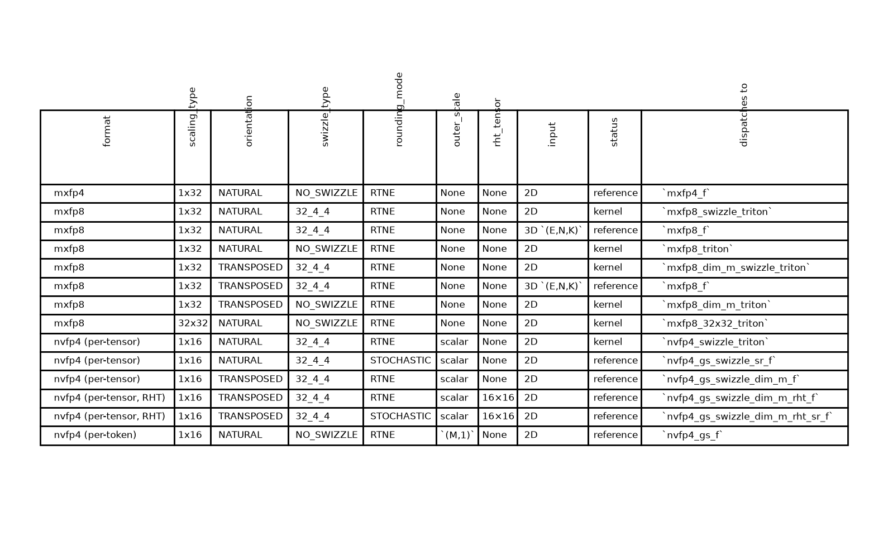

# `quantize_tensor` API

A prototype quantize-cast API that turns a bf16/fp32 tensor into a block-scaled low-precision
format (qdata + scale).

Four entry points:

| entry point | orientation(s) | shape | typical use |
|---|---|---|---|
| `quantize_tensor` | one (NATURAL **or** TRANSPOSED) | 2D `(M,K)` or 3D `(E,N,K)` | dense inference or training |
| `quantize_tensor_bidirectional` | both, one read | 2D `(M,K)` | training |
| `quantize_tensor_grouped` | one | 2D `(total_M, C)` + `offs` | MoE inference or training |
| `quantize_tensor_grouped_bidirectional` | both, one read | 2D + `offs` | MoE training |

The rest of this doc focuses on the **dense unidirectional** entry point, `quantize_tensor`.

## 1. Dense unidirectional API signature

```python
def quantize_tensor(
    input: Tensor,
    *,
    qdata_dtype: torch.dtype = torch.float8_e4m3fn,
    inner_scale_calc: InnerScaleCalc = InnerScaleCalc.E8M0_RCEIL,
    scaling_type: ScalingType = ScalingType.BlockWise1x32,
    orientation: QuantOrientation = QuantOrientation.NATURAL,
    swizzle_type: SwizzleType = SwizzleType.SWIZZLE_32_4_4,
    rounding_mode: RoundingMode = RoundingMode.RTNE,
    random_key: Tensor | None = None,
    outer_scale: Tensor | None = None,
    rht_tensor: Tensor | None = None,
) -> tuple[Tensor, Tensor]:  # (qdata, scale)
```

| argument | meaning |
|---|---|
| `input` | 2D `(M, K)` or 3D `(E, N, K)` bf16/fp32 tensor. nvfp4 is 2D-only. |
| `qdata_dtype` | qdata element format: `torch.float8_e4m3fn` (mxfp8) or `torch.float4_e2m1fn_x2` (nvfp4 / mxfp4). |
| `inner_scale_calc` | per-block scale strategy (fixes scale dtype + amax→scale): `E8M0_RCEIL` (mxfp8/mxfp4) or `E4M3_NVFP4` (nvfp4, relative to a per-tensor fp32 outer scale). |
| `scaling_type` | 2D scale block size: `BlockWise1x32` / `BlockWise32x32` (mxfp8), `BlockWise1x16` (nvfp4). |
| `orientation` | how the block maps onto `(M, K)`: `NATURAL` = as given; `TRANSPOSED` = the `(K, M)` view, outputs written transposed-contiguous. |
| `swizzle_type` | `NO_SWIZZLE` or `SWIZZLE_32_4_4` (the blocked scale layout GEMMs consume). Per-expert on 3D input. |
| `rounding_mode` | `RTNE` or `STOCHASTIC`. SR is wired only for the per-tensor swizzled nvfp4 casts (NATURAL, and TRANSPOSED which then needs `rht_tensor`); everything else is RTNE-only. |
| `random_key` | SR entropy — a `torch.func._random` Philox key. Required **iff** `rounding_mode=STOCHASTIC`. |
| `outer_scale` | precomputed fp32 outer scale, required for nvfp4 (must be `None` otherwise). A per-tensor scalar → per-tensor nvfp4 (swizzled kernel); an `(M, 1)` scale → per-token nvfp4 (gold reference). |
| `rht_tensor` | optional 16×16 Random Hadamard Transform. Only the per-tensor dim-m (TRANSPOSED) swizzled nvfp4 cast uses it (applies RHT to `input.t()` — the wgrad-operand cast of nvfp4 training). |

Returns `(qdata, scale)`. For the fused both-orientation cast use `quantize_tensor_bidirectional`;
for MoE (`offs`-grouped) casts use `quantize_tensor_grouped` / `quantize_tensor_grouped_bidirectional`.

## 2. Formats

**Supported today**

- **mxfp8** — `float8_e4m3fn` qdata + `e8m0` (power-of-two) inner scale, `1x32` or `32x32` blocks. No
  outer scale.
- **nvfp4** — `float4_e2m1fn_x2` qdata (two e2m1 codes per byte) + `e4m3` `1x16` inner scale computed
  relative to a per-tensor fp32 **outer** scale (two-level scaling). Per-tensor (incl. RHT and
  stochastic-rounding variants) and per-token `(M, 1)`.
- **mxfp4** — `float4_e2m1fn_x2` qdata + `e8m0` `1x32` inner scale (single-level). NATURAL only.

**Could be supported** (hooks that exist in the enums / ecosystem but are not wired — dispatch
raises `ValueError`):

- fp8 `RowWise` / `TensorWise` scaling.
- fp8 `BlockWise1x128` / `BlockWise128x128` (DeepSeek-style blockwise).
- mxfp4 in TRANSPOSED / swizzled / grouped forms.
- nvfp4 with parametric (non-16×16) RHT sizes — see the `rht_tensor` TODO at
  [`api.py:99-102`](api.py).

These `ScalingType` values (`RowWise`, `TensorWise`, `BlockWise1x128`, `BlockWise128x128`) are
already defined in the enum, but no dispatch branch consumes them yet.

## 3. Support matrix — `quantize_tensor` only

Each row is one argument combination the dispatch recognizes. `32_4_4` = `SWIZZLE_32_4_4`; block
sizes `1x16` / `1x32` / `32x32` are `BlockWise*`. status: **kernel** = Triton kernel; **reference**
= gold PyTorch ref (no kernel yet).

`format` fixes `qdata_dtype` and `inner_scale_calc`, so those two columns are factored out into this
map (all `nvfp4` variants share the same pair):

| format | qdata_dtype | inner_scale_calc |
|---|---|---|
| mxfp8 | `float8_e4m3fn` | `E8M0_RCEIL` |
| mxfp4 | `float4_e2m1fn_x2` | `E8M0_RCEIL` |
| nvfp4 (all variants) | `float4_e2m1fn_x2` | `E4M3_NVFP4` |

The chart below ([`support_matrix.png`](support_matrix.png)) is rendered by
[`gen_support_matrix.py`](gen_support_matrix.py), which **probes the real API** — it runs every
argument combination through `quantize_tensor` on CUDA tensors and keeps the ones the dispatch
accepts (rows sorted lexicographically), recording the recipe each dispatches to. The image is a
generated artifact — do not hand-edit; rerun `python gen_support_matrix.py` after changing `api.py`'s
dispatch (a CUDA device is required).

<!-- BEGIN GENERATED: support-matrix (python gen_support_matrix.py) -->



<!-- END GENERATED: support-matrix -->
