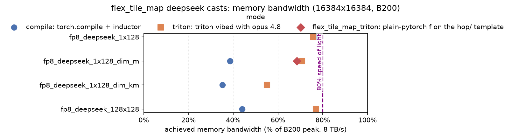

# flex_tile_map

API:

```python
# TODO align aux_inputs with flex_gemm
outputs = flex_tile_map(fn, input, aux_inputs)
```

## Reason #1 to exist: express CODA in fwd+bwd without resorting to large `torch.autograd.Function`

**Before** (without flex_tile_map): user writes large `torch.autograd.Function` and
fuses gemm to epilogue by hand

```python
class FunctionalMLP(torch.autograd.Function):  # out = relu(x @ w1) @ w2
    @staticmethod
    def forward(ctx, x, w1, w2):
        d, c = flex_gemm(torch.mm, (x, w1), lambda c: (c.relu(), c))
        e = torch.mm(d, w2)
        ctx.save_for_backward(x, w1, w2, c, d)
        return e

    @staticmethod
    def backward(ctx, grad_e):
        x, w1, w2, c, d = ctx.saved_tensors
        grad_d = flex_gemm(torch.mm, (grad_e, w2.t()), lambda gd: gd * (c > 0))
        grad_x = torch.mm(grad_d, w1.t())
        grad_w1 = torch.mm(x.t(), grad_d)
        grad_w2 = torch.mm(d.t(), grad_e)
        return grad_x, grad_w1, grad_w2

e = FunctionalMLP.apply(x, w1, w2)
```

**After** (with flex_tile_map): user writes `torch.mm` + `flex_tile_map(..., fn)`,
torch.compile fuses the fwd+bwd parts to get equivalent code to the manual
`torch.autograd.Function` above.

```python
@torch.compile()
def f(x, w1, w2):  # out = relu(x @ w1) @ w2
    c = torch.mm(x, w1)
    d = flex_tile_map(c, lambda c: c.relu())  # fuses with the mm above -> one flex_gemm kernel
    return torch.mm(d, w2)

e = f(x, w1, w2)
```

## Reason #2 to exist: lightweight "tiled f" API, backend easier to optimize than general compiler

On the chart below - inductor not good at 1x128 cast across m-dim, or 128x128. 
Easy to hand write triton kernels for these, and ~easy to make it generic to cover quant cast variants.




TODO(later) talk somewhere about quant cast taxonomy, tile invariant-ness, and aligning everything


## slop below (ignore)

The chart reuses the benchmarks-README infra (same CSV + `plot_bench.py`, no duplication).
Regenerate with:

```bash
# 1. gather the numbers (merges into the shared CSV; needs a B200)
python benchmarks/benchmark.py --mode compile              --csv benchmarks/bench_results.csv
python benchmarks/benchmark.py --mode triton               --csv benchmarks/bench_results.csv
python benchmarks/benchmark.py --mode flex_tile_map_triton --csv benchmarks/bench_results.csv

# 2. render this chart (no GPU needed) -- deepseek only, no cute, adds the flex_tile_map_triton series
python benchmarks/plot_bench.py \
    --modes compile,triton,flex_tile_map_triton --kernel_filter deepseek \
    --groups False --fig_height 3.0 \
    --out quant_cast_bench/flex_tile_map/deepseek_mem_bw.png \
    --title "flex_tile_map deepseek casts: memory bandwidth (16384x16384, B200)"
```

(±1–2 pts run-to-run variance; the `relu` bandwidth ceiling for this shape is ~75%.)
