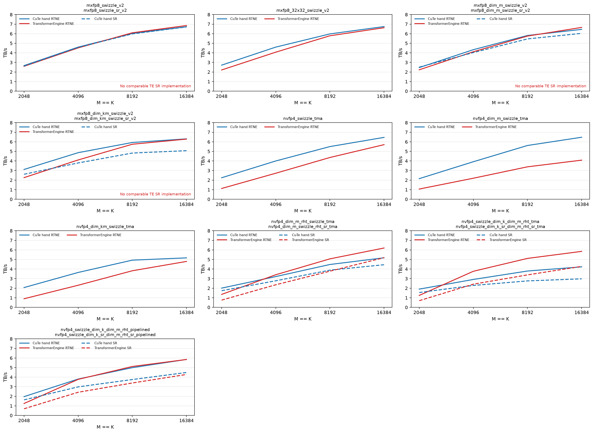

# Handwritten CuTe quantization kernels

## Performance versus TransformerEngine

The charts report logical throughput for BF16 square inputs on B200. Each panel compares
matching kernels exposed by `benchmark_transformer_engine.py`. CuTe-hand results are blue,
TransformerEngine results are red, RTNE is solid, and stochastic rounding is dashed. RHT
and non-RHT kernels remain in separate panels. A missing red SR line means that
TransformerEngine has no comparable stochastic MXFP8 implementation. The MXFP8 comparisons
include both the conventional 1x32 scale blocks and the 32x32 scale blocks used by
`mxfp8_32x32_swizzle_v2`.



Regenerate the benchmark CSV and chart from the repository root with:

```bash
CUDA_VISIBLE_DEVICES=1 \
  quant_cast_bench/quant_cast_cute_hand/update_transformer_engine_comparison.sh
```

The script runs the paired square-shape sweep at 2048, 4096, 8192, and 16384, writes
[`transformer_engine_comparison.csv`](transformer_engine_comparison.csv), and renders the
figure with Matplotlib.
