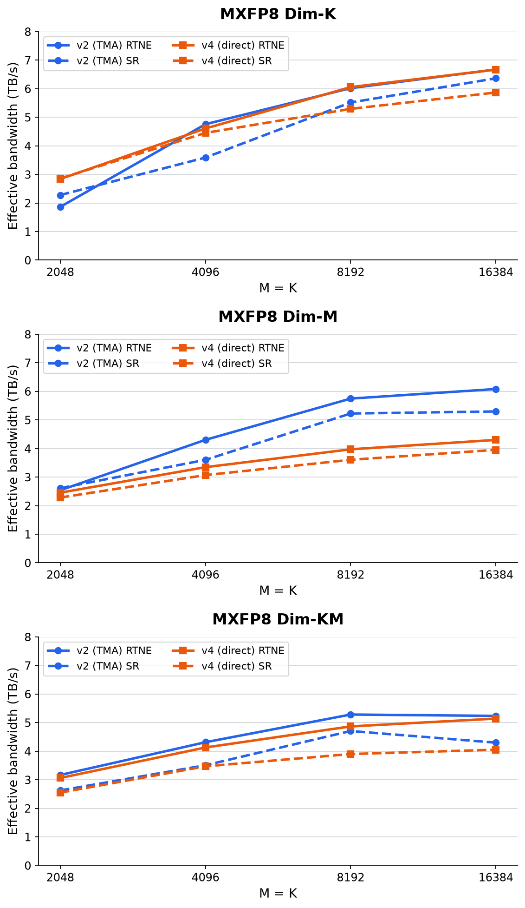

# Handwritten CuTe MXFP8 kernels

## TMA versus direct-load performance

These plots compare the v2 TMA implementation with the v4 direct-load implementation on an
NVIDIA B200 using BF16 inputs. Shapes are square (`M = K`) and treated as categorical points on the
x-axis. The y-axis is fixed at 0–8 TB/s across every plot; higher is better.

- **v2 (TMA):** stages input and output through shared memory using Tensor Memory Accelerator
  transfers.
- **v4 (direct):** uses vectorized global loads/stores, adding a shared-memory transpose scratchpad
  only for paths containing dim-M.
- **RTNE:** solid lines.
- **Stochastic rounding:** dashed lines.



The measurements were collected with:

```bash
python quant_cast_bench/quant_cast_cute_hand/benchmark.py \
  --kernel mxfp8_swizzle_v2,mxfp8_dim_m_swizzle_v2,mxfp8_dim_km_swizzle_v2,mxfp8_swizzle_v4,mxfp8_dim_m_swizzle_v4,mxfp8_dim_km_swizzle_v4,mxfp8_swizzle_sr_v2,mxfp8_dim_m_swizzle_sr_v2,mxfp8_dim_km_swizzle_sr_v2,mxfp8_swizzle_sr_v4,mxfp8_dim_m_swizzle_sr_v4,mxfp8_dim_km_swizzle_sr_v4 \
  --M 2048,4096,8192,16384 \
  --K 2048,4096,8192,16384 \
  --mk_mode pair
```
