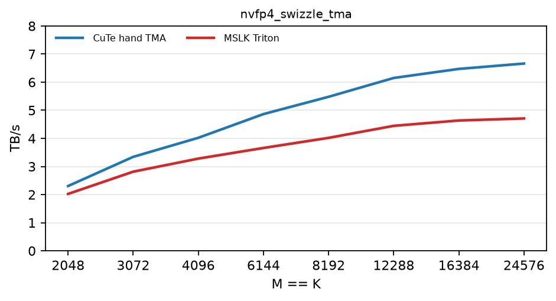

# Handwritten CuTe quantization kernels

## Performance versus TransformerEngine

The charts report logical throughput for BF16 square inputs on B200, and every panel
labels its input dtype explicitly. Each panel compares
matching kernels exposed by `benchmark_transformer_engine.py`. CuTe-hand results are blue,
TransformerEngine results are red, RTNE is solid, and stochastic rounding is dashed. RHT
and non-RHT kernels remain in separate panels. A missing red SR line means that
TransformerEngine has no comparable implementation for that recipe. The MXFP8 comparisons
include both the conventional 1x32 scale blocks and the 32x32 scale blocks used by
`mxfp8_32x32_swizzle_v2`. The MXFP4 section includes dim-K, dim-M, and dim-KM CuTe-hand
measurements; the installed TransformerEngine has no comparable optimized MXFP4 quantizer,
so those panels explicitly mark the TE result as unavailable. Panels are grouped into
MXFP8, MXFP4, and NVFP4 sections. RHT recipes use the pipelined kernel family; the NVFP4
section includes shared RTNE/SR panels for its dim-M and dim-KM variants. The dim-K
sections also include the compact, unswizzled-scale `mxfp8`, `mxfp4`, and `nvfp4`
recipes; TransformerEngine is configured without GEMM scale swizzling for the matching
MXFP8 and NVFP4 measurements. The NVFP4 section additionally includes the square
16x16-scale `nvfp4_swizzle_16x16_tma` recipe, compared with TransformerEngine's
`with_2d_quantization=True` path.


Regenerate the benchmark CSV and chart from the repository root with:

```bash
CUDA_VISIBLE_DEVICES=1 \
  quant_cast_bench/quant_cast_cute_hand/benchmarks/update_transformer_engine_comparison.sh
```

The script runs a paired square-shape sweep over powers of two and their midpoints from
2048 through 24576, writes
[`transformer_engine_comparison.csv`](transformer_engine_comparison.csv), and renders the
figure with Matplotlib.

## Performance versus MSLK

These charts compare the CuTe-hand TMA dim-K kernels with MSLK's dense Triton kernels
for both MXFP4 and NVFP4. Every panel explicitly labels the input dtype as BF16. The
NVFP4 kernels receive the same precomputed global scale and produce bitwise-identical
packed FP4 data and swizzled scale bytes. The MXFP4 kernels implement the same 1x32
E2M1/E8M0 quantization class but use different scale-selection conventions, so the
benchmark validates both through dequantized SQNR rather than bitwise equality. All
results use the same logical byte count; CuTe hand is blue and MSLK is red.



Regenerate the benchmark CSV and chart from the repository root with:

```bash
CUDA_VISIBLE_DEVICES=1 \
  quant_cast_bench/quant_cast_cute_hand/benchmarks/update_mslk_comparison.sh
```

The script runs a paired square-shape sweep over powers of two and their midpoints from
2048 through 24576, writes
[`mslk_comparison.csv`](mslk_comparison.csv), and renders the figure with Matplotlib.
